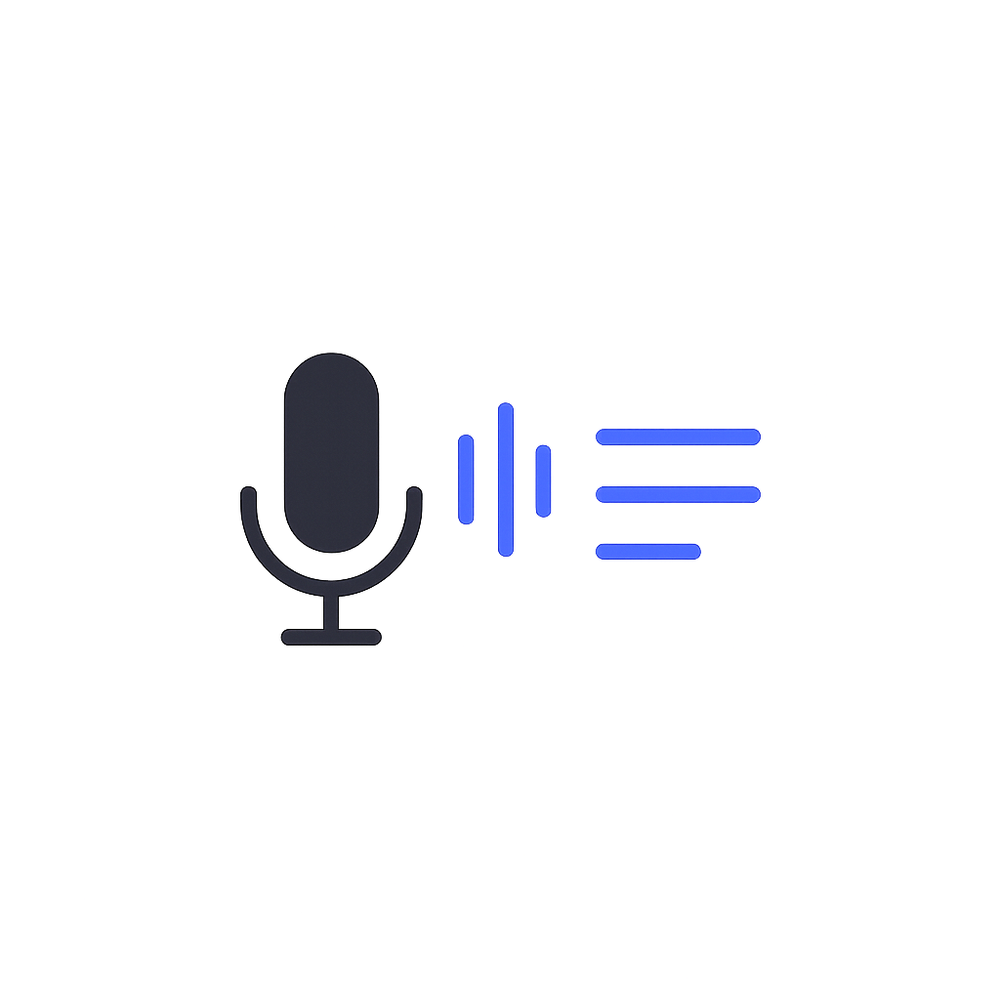

<p align="center">
  
</p>

<h1 align="center">Rec+</h1>

<p align="center">
  <strong>Record system audio and your microphone at once — with a live transcript.</strong>
</p>

<p align="center">
  A native macOS app that captures the Mac's system output and your voice as two independent<br/>
  streams, mixes them into a single clean recording, and transcribes speech live as you go.
</p>

<p align="center">
  
  
  <a href="https://github.com/e-palmisano/recplus"></a>
  <a href="https://www.linkedin.com/in/enzo-palmisano-b16363147/"></a>
</p>

---

## Features

- 🎙️ **Simultaneous capture** — records the Mac's system output and your microphone as two independent streams, so a stall or dropout in one never corrupts the other
- 🔊 **Passive system tap** — taps the default output device via Core Audio without rerouting it; whatever's playing keeps playing normally through the speakers
- 🎚️ **Wall-clock aligned mixdown** — on stop, both streams are mixed into a single AAC (`.m4a`) file, aligned by their real start times (not a fixed assumed gap) so system audio and voice stay in sync
- 📝 **Live transcription** — [WhisperKit](https://github.com/argmaxinc/WhisperKit) transcribes speech in real time as you record, with the transcript shown live in an expanding view and saved to a timestamped `.txt` file alongside the recording
- 📦 **Model auto-download** — the Whisper model downloads automatically on first use; later recordings skip straight to transcribing, no progress bar in the way
- 🖥️ **Simple, focused UI** — pick a microphone, hit record, watch the elapsed time, jump straight to the finished file in Finder

**Deliberately not doing:** audio routing/virtual devices, multi-track export, cloud transcription — Rec+ stays a focused local recorder, not a studio suite.

---

## Install

Prebuilt, notarized releases are published on the [Releases page](https://github.com/e-palmisano/recplus/releases) as a `.dmg` — download, drag Rec+ into `/Applications`, done. No Gatekeeper warnings: every release is signed with a Developer ID certificate and notarized by Apple.

Alternatively, build it from source (see below).

---

## Permissions

Rec+ is sandboxed and asks for exactly what it needs, no more:

| Entitlement | Why |
|---|---|
| Microphone | Record your voice alongside system audio |
| System audio capture | Tap the system's output device for recording |
| User-selected files (read/write) | Let you choose where recordings are saved |
| Music library (read/write) | Save recordings alongside your other audio |
| Network client | Download the Whisper transcription model on first use |

macOS will prompt for microphone and system-audio-capture permission on first launch — both are required for a recording with both sources.

---

## How it works

1. **`MicRecorder`** and **`SystemAudioTap`** each record to their own temporary `.caf` file, started a fraction of a second apart to avoid a Core Audio aggregate-device race.
2. While recording, **`TranscriptionEngine`** resamples both streams to 16kHz mono, mixes them, and runs WhisperKit on a rolling window with silence-based segment finalization — so the transcript updates live without waiting for you to stop.
3. Once you stop, **`AudioMixer`** aligns the two `.caf` files by wall-clock start time (whichever stream started later gets leading silence inserted) and sums them into a single 48kHz stereo buffer with headroom to avoid clipping.
4. The result is written out as AAC (`.m4a`), and the finalized transcript is written to a matching `.txt` file; the temporary `.caf` files are deleted.

---

## Repository Layout

| Path | Role |
|------|------|
| `AudioRecorder/AudioRecorderApp.swift` | App entry point |
| `AudioRecorder/ContentView.swift` | Main window UI |
| `AudioRecorder/RecordingSession.swift` | Coordinates start/stop across recorders and transcription |
| `AudioRecorder/SystemAudioTap.swift` | Core Audio process-tap for system output |
| `AudioRecorder/MicRecorder.swift` | Microphone capture via AVAudioEngine |
| `AudioRecorder/AudioMixer.swift` | Wall-clock aligned mixdown to AAC |
| `AudioRecorder/TranscriptionEngine.swift` | Live WhisperKit inference loop |
| `AudioRecorder/LiveResampler.swift` / `LiveMixer.swift` | Resampling/mixing feeding the transcription engine |
| `AudioRecorder/SpeechSegmenter.swift` | Silence-based segment finalization |
| `AudioRecorder/TranscriptWriter.swift` | Transcript `.txt` formatting |
| `AudioRecorder/CoreAudioSupport.swift` | Core Audio device helpers |
| `AudioRecorder/Formatting.swift` | Time/filename formatting helpers |

---

## Building from Source

Requires macOS 14.4+, Xcode 16+, and [XcodeGen](https://github.com/yonaskolb/XcodeGen) (`brew install xcodegen`). The Xcode project is generated from [`project.yml`](project.yml) — don't edit `AudioRecorder.xcodeproj` directly, it's regenerated and not meant to be hand-maintained.

```bash
brew install xcodegen
xcodegen generate
open AudioRecorder.xcodeproj
```

Build and run with `⌘R`.

Single verification gate for the whole repo:

```bash
Scripts/ci.sh    # → "CI OK" if everything passes
```

---

## Releasing

Pushing a `vX.Y.Z` tag (matching `MARKETING_VERSION`/`CURRENT_PROJECT_VERSION` in `project.yml`) triggers [`.github/workflows/release.yml`](.github/workflows/release.yml), which:

1. Runs `Scripts/ci.sh` as a gate.
2. Archives and exports the app, signed with a Developer ID Application certificate.
3. Notarizes and staples the ticket via `notarytool`.
4. Packages it into a `.dmg` via `Scripts/build-dmg.sh`.
5. Publishes a GitHub Release with the DMG and an auto-generated changelog.

This runs on a self-hosted macOS runner and needs the following repository secrets: `MAC_LOGIN_KEYCHAIN_PASSWORD`, `DEVELOPER_ID_CERTIFICATE_P12`, `DEVELOPER_ID_CERTIFICATE_PASSWORD`, `KEYCHAIN_PASSWORD`, `ASC_API_KEY_P8`, `ASC_API_KEY_ID`, `ASC_API_ISSUER_ID`.

---

## Acknowledgements

Built with the help of AI pair programmers:

- **[Claude Code](https://claude.ai/code)** by Anthropic — architecture, implementation, and review throughout the project.
